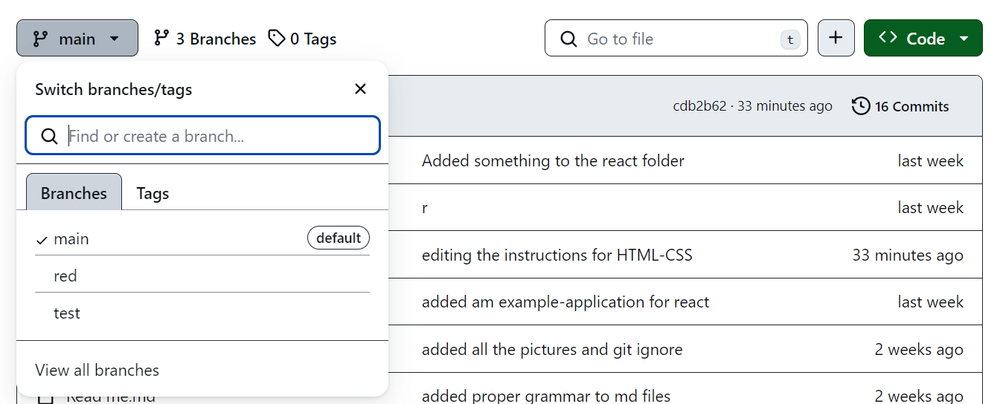

[GO TO FIGMA DESIGN FILE](https://www.figma.com/file/AkcjecDdlGFnA28GoPkuov/html-css-test?type=design&node-id=0%3A1&mode=design&t=FLcNW1dnXy8vKfhu-1)

## MORE INSTRUCTIONS
1. LEADER OF THE GROUP SHOULD CREATE A GITHUB REPOSITORY
 - add readme.md file( its fine to have nothing in it)
 
2. Invite all your collaborators
 - go to the github repository
 - click settings and collaborators
 - start addings your fellow group members

3. collaborators want to go to their email and accept the invite to collaborate
  - the collaboratory repository should now be in your list of repositorys(?? might be correct)
  - if not there just have leader send link 

4. Eberyone should open the collaborator repository in VSCODE

5. Leader of the groups should open VSCODE and share their screen doing then do the followings(only leader should be doing) in vscode
 - create a html file with a name of your choosing
 - add boiler plate(starter code) to html
 - create a css file with a name of your choosing
 - Link the css file to your html file
 - open live server to verify everything is correct!

6. The Leader then should push the following code to github, after that the others want to git pull down the changes!
 - git push
 - git pull

7. Everyone wants to create their own branch(including the leader) - name the branch your first name
 - git branch - used to see all the branches( should only be one currently)
 - git branch "name" - to create new branch
 - git checkout "name" - to switch to the following branch

8. Now start working on turning something similar to the [design file](https://www.figma.com/file/AkcjecDdlGFnA28GoPkuov/html-css-test?type=design&node-id=0%3A1&mode=design&t=FLcNW1dnXy8vKfhu-1) into html and css!
 - you can communicate with each other while trying to get to your solution

9. Start by adding all the html elements in this order
 - img element - for an image of you
 - header element - for your name
 - header element - for profession(OR ANYTHING ELSE)
 - div element - for seperator
 - p element - description of you
 - button element - FOR the buttons

10. Style your page
 - Go to the css file you created and linked earlier
 - now start by grabbing elements( you can also add classes , or ids to your elements)
   - see the html and css file for examples
   - grab a class using "#" and class "." before name
   - classes and ids cant have spaces "hello-class" instead of "hello class"

11. After done styling, find a way to push your branch up to the repository
 -  git push --set-upstream origin "name" ( might work only on the first time, having to push a branch up!)
 - the leader might have to allow the push request

12. pull down everyone branches, then navigate to someone elses branch
 -  git pull
 -  git branch -a (doing it without -a, you will not see the other poeple branches pull down)
  - some branch names should appear like this "remotes/origin/red" ( red being the name I named the branch)
 - git checkout "name" - in the example about I would enter "git checkout red"

13. View other group members branches, and discuss with each other!

Optional - 
The leader can then choose to merge his branch with the Main branch

etc - see branches on github.con by clicking the following button

## CSS PROPERTIES YOU WILL USE
- font size - change the font size
- margin - space between an element in it surroundings
- padding - space between the element, and the content inside
- color - usually used to change color of text
- background-color - change background color
- height - height of the element
- width - width of the element

# advanced
- display -  mainly want to learn flex
