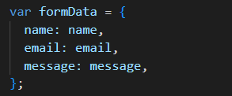

---

# Today's Task: Creating a Form, Grabbing Form Data Using DOM, and Sending Data to a Backend Server

## Step 1: Setup Your Starting Folders

- Create your HTML file.
- Create a CSS file.
- Create your JavaScript script file.
- Link the CSS and script to your HTML file.

## Step 2: Create Your Form in the HTML Folder

- Make a `<form>` tag inside the body of your HTML.
- Create inputs and label them to get the following data:
  - Name
  - Email
  - Message

- Add an input for submitting the form.

## Step 3: Add Event Listener for Form Submit

- In the script you created, find a way to get the form.
- Add an event listener for when the form is submitted.
- When this event happens, you want to:
  - Create variables called `name`, `message`, and `email`.
  - Get the value in the form and store them in their corresponding variable that you created.
    
  - Store those values in an object.
    
- You're done with this event for now. You can `console.log` the info to check if everything works.

## Step 4: Create `submitForm` Function

- The function should take a parameter.
- The function should have a Fetch with a method of POST.
- Use the link below in the endpoints to Submit the message.
- The body of the Fetch request should take the form data.
- Use a `then` and `catch` for if the Fetch failed.
- In the form submit event listener, pass the `formData` object into the `submitForm` function.
 

## Step 5: Create `getAllMessage` Function

- This function will interact with the backend and get all the messages.
- You want to fetch the "get all the messages" endpoint and then `console.log` them.

## Step 6: Call the `getAllMessage` Function

- Call the `getAllMessage` function to see if your message is in the array.

## Endpoints

- Submit the message: `https://r31jbh92tk.execute-api.us-east-1.amazonaws.com/dev/submit_message`
- Get all the messages: `https://r31jbh92tk.execute-api.us-east-1.amazonaws.com/dev/get_all_messages`

---